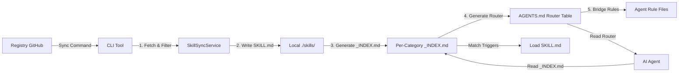
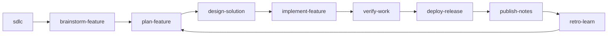

# Architecture & Design Records

This document captures the high-level design, data flow, and key decision records for the `agent-skills-standard` CLI.

## 1. System Overview

The system consists of three main components:

1. **Registry**: A Git repository (or local folder) containing skill definitions (`SKILL.md`) and metadata (`metadata.json`).
2. **CLI**: The setup/sync/validate tool that fetches, validates, and syncs these skills to a project.
3. **Local Project**: The user's codebase where skills and workflows are installed in each agent's native format.

### Data Flow

### Hierarchical Skill Resolution (v2.1+)

AI agents follow a three-step lookup:

1. **AGENTS.md** (~20 lines) — router table maps file extensions to category `_INDEX.md` files.
2. **`_INDEX.md`** (~10-15 lines per category) — tiered trigger table with File Match and Keyword Match sections.
3. **`SKILL.md`** — loaded on-demand only when triggers match.

This replaces the previous flat index (all skills in one list) and reduces scan cost from O(n) to O(1).

## 2. Multi-Agent Compatibility (The "Integration Taxonomy")

This project maintains a standardized bridge for multiple AI agents, each with varying levels of native support for hooks and context injection.

| Agent / Tool        | Integration Strategy       | Primary Hook/Config                      | Scope        |
| :------------------ | :------------------------- | :--------------------------------------- | :----------- |
| **VS Code Copilot** | **Prompt Instructions**    | `.github/instructions/*.instructions.md` | Session      |
| **Cursor**          | **MCP + Rules**            | `hooks.json` / `.cursor/rules/`          | Project      |
| **Windsurf**        | **MCP + Rule Persistence** | `.codeium/windsurf/mcp_config.json`      | Project      |
| **Trae**            | **MCP + Rule Persistence** | `.trae/mcp.json`                         | Project      |
| **Roo Code**        | **MCP + Rule Persistence** | `.clinerules` / `.roo/mcp_config.json`   | Project      |
| **Claude Code**     | **Bash Interception**      | `.mcp.json` / `~/.claude/`               | User/Project |
| **Gemini CLI**      | **BeforeTool Middleware**  | `.gemini/settings.json`                  | User/Project |

## 3. SDLC Standards Layer

The registry is a portable standards source, not a daily command runtime. `ags`
initializes, syncs, validates, and wires MCP; users then invoke synced workflows
inside Claude, Codex, Cursor, Gemini, Copilot, Kiro, Antigravity, or another
configured agent.

Canonical lifecycle workflows live in `.agents/workflows`:

Workflow export still follows the agent integration taxonomy:

- Antigravity/Kiro: native markdown workflows
- Claude/Roo/OpenCode: command markdown
- Gemini: TOML commands
- Copilot: prompt files
- Cursor/Trae/Codex: skill folders with `SKILL.md`

Requirement layering is explicit in the SDLC workflow names and outputs:

- `brainstorm-feature` = BRD-lite ("Why")
- `plan-feature` = PRD ("What")
- `design-solution` = SRS/FRS ("How")
- `implementation-readiness` and later phases enforce living traceability updates across BRD-lite -> PRD -> SRS/FRS -> verification evidence

## 4. Hook-Based Transparency

Inspired by **Rust Token Killer (RTK)**, we aim for a zero-trust, low-overhead context model. This means:

1. **Lazy Loading**: Skills are NOT loaded until a tool call (MCP) or triggered by the router (`AGENTS.md`).
2. **Transparent Interception**: Like RTK's bash hooks, our MCP server aims to intercept file read requests (e.g. `read_file`) and inject relevant skill rules into the output, saving the agent from needing to manually fetch rules.
3. **Token Filtering**: We prioritize high-density information. The `_INDEX.md` model reduces the initial "scouting" tokens by 90% compared to a flat rule list.

## 5. Core Services

### SyncService (`cli/src/services/SyncService.ts`)

The brain of the operation. It orchestrates the synchronization process.

- **Responsibility**: Fetching, filtering/excluding, writing files, generating `_INDEX.md` per category, and generating router-style `AGENTS.md`.
- **Key Dependencies**: `SkillSyncService`, `WorkflowSyncService`, `IndexGeneratorService`, `AgentBridgeService`.
- **Design Principle**: "Safe Overwrite". It respects `custom_overrides` in `.skillsrc`.

### IndexGeneratorService (`cli/src/services/IndexGeneratorService.ts`)

Responsible for creating the "Context Bridge" for AI agents. Produces two output formats:

- **Router Index** (`assembleRouterIndex()`): Compact AGENTS.md that maps file extensions to `_INDEX.md` paths (~20 lines).
- **Category Index** (`generateCategoryIndex()`): Per-category `_INDEX.md` with tiered File Match vs Keyword Match sections.
- **Flat Index** (`assembleIndex()`): Legacy flat list format, still used for the registry's own AGENTS.md.
- **Three-Tier Model**: Skills with broad file globs (e.g., `**/*.ts`) are automatically demoted to Keyword Match unless they are the designated `base_language_skills` for that category (defined in `metadata.json`).

### SkillSyncService (`cli/src/services/SkillSyncService.ts`)

Handles fetching and writing skill files from the remote registry.

- **Responsibility**: Downloading SKILL.md + references from GitHub, writing to agent directories, pruning orphaned skills.

### WorkflowSyncService (`cli/src/services/WorkflowSyncService.ts`)

Handles workflow distribution from a single canonical source.

- **Canonical Source**: `.agents/workflows/*.md` remains the authoring surface in this repository.
- **Responsibility**: Fetching canonical workflows from the registry and exporting them into each agent's native invocation format.
- **Export Model**:
  - Antigravity/Kiro: native markdown workflow files
  - Claude/Roo/OpenCode: command markdown
  - Gemini: TOML command files
  - Copilot: prompt files
  - Cursor/Trae/Codex: skill folders (`SKILL.md`)
- **Codex Note**: Codex does not consume `.agents/workflows` directly; it receives transformed workflow skills under `.codex/skills/<workflow>/SKILL.md`.
- **SDLC Note**: Default workflows include the full SDLC spine from `sdlc` through `retro-learn`; teams may sync a subset through `.skillsrc`.
- **Agentic Runtime Note**: Core SDLC workflows emit `Runtime Contract`, `Handoff Payload`, `Blocking Questions`, and `Next Workflow` sections so slash-command agents and channel agents can continue, pause, or delegate with the same artifact shape.

### ConfigService (`cli/src/services/ConfigService.ts`)

Manages the user configuration (`.skillsrc`).

- **Responsibility**: Parsing YAML, validating schema (Zod), and resolving dependency exclusions (e.g. "Don't install React skills if this looks like Vue").

### AgentBridgeService (`cli/src/services/AgentBridgeService.ts`)

Creates agent-specific rule files that point to AGENTS.md.

- **Responsibility**: Generates discovery instructions for each agent (Cursor `.mdc`, Copilot instructions, Claude `CLAUDE.md` protocol, Antigravity/Windsurf/Trae rule files).

## 6. Token Economy (Design Constraint)

This is a **High-Density** project. Every feature must be evaluated against its impact on the AI's context window.

- **Skill Files**: Must be < 100 lines, averaging ~500 tokens.
- **Router Index**: ~20 lines (~600 tokens) — constant regardless of skill count.
- **Category Index**: ~10-15 lines per category.
- **References**: Heavy content goes to `references/` folder, loaded only on demand.
- **Behavior Guardrails**: Discipline skills may add pressure scenarios, rationalizations, red flags, and behavior assertions in `evals/evals.json`, not by bloating `SKILL.md`.
- **Quality Model**: Treat skill health as four axes: routing accuracy, structural quality, token economy, and behavior-pressure coverage for guardrail skills.

## 7. Metadata Configuration (`skills/metadata.json`)

Registry-level configuration that controls index generation:

- **`file_routing`**: Maps file extensions to skill categories for the router table.
- **`broad_globs`**: List of glob patterns considered "too broad" for auto-triggering (e.g., `**/*.ts`).
- **`base_language_skills`**: One skill per category that keeps the broad glob in File Match. All others are demoted to Keyword Match.
- **`foundational_composite_rules`**: Auto-injected composite triggers based on skill name patterns.
- **`categories`**: Version, tag prefix, and token metrics per category.

## 8. Decision Records

### ADR-001: Local-First Indexing

_Date: 2026-02-07_
**Decision**: `SyncService` should generate the index by scanning the _local_ disk after writing files, rather than using the in-memory list of fetched skills.
**Reason**: This ensures that manual edits or custom local skills created by the user are also included in the index, making the system "User-Extensible" by default.

### ADR-002: Internal Tools Separation

_Date: 2026-02-07_
**Decision**: Documentation scanners and maintenance scripts live in `scripts/` but are NOT bundled into the CLI binary.
**Reason**: Keeps the user-facing CLI binary small and focused.

### ADR-003: Hierarchical Skill Resolution

_Date: 2026-04-04_
**Decision**: Replace the flat AGENTS.md index with a two-level hierarchy: router table + per-category `_INDEX.md` files with tiered trigger sections (File Match vs Keyword Match).
**Reason**: The flat index grew to 238+ entries (~300 lines). LLMs cannot reliably scan a 300-line list to find matching skills. The hierarchical approach reduces scan cost to ~25 lines per lookup regardless of total skill count, and the three-tier model prevents 30+ skills from matching a single file extension.

### ADR-004: Three-Tier Trigger Model

_Date: 2026-04-04_
**Decision**: In `_INDEX.md`, skills are classified into File Match (auto-check against edited file) and Keyword Match (only when user's request mentions the concept). Broad globs are stripped from non-base skills.
**Reason**: Without tiering, editing a `*.ts` file matched 27+ skills simultaneously. With tiering, only 6 genuinely relevant skills match via file pattern. Cross-cutting skills (best-practices, security, performance) activate only when the user explicitly mentions them.

### ADR-005: Standards Registry, Not Command Runtime

_Date: 2026-05-14_
**Decision**: Keep `ags` as a setup/sync/validate tool. Do not add an ECC-style daily command runtime. SDLC workflows are portable repo assets exported into each configured agent's native invocation surface.
**Reason**: The project differentiates through open standards, token-efficient routing, multi-agent sync/export, MCP enforcement, and local customization. Users should own the synced files and invoke them through their existing agent runtime.

### ADR-006: SDLC Workflow Spine

_Date: 2026-05-14_
**Decision**: Ship a compact default SDLC workflow chain: `sdlc`, `brainstorm-feature`, `plan-feature`, `design-solution`, `implementation-readiness`, `implement-feature`, `review-ticket`, `verify-work`, `traceability-audit`, `deploy-release`, `publish-notes`, `session-report`, and `retro-learn`.
**Reason**: Existing workflows covered isolated steps. A visible lifecycle spine makes the repository an SDLC standards layer while preserving token economy through short workflow files and references.

### ADR-007: Specialists Are Native Sub-Agents

_Date: 2026-05-14_
**Decision**: Keep `skills/specialists/*/SKILL.md` as registry source, but sync them directly to native sub-agent folders instead of normal skill folders. Specialists stay compact, budgeted, and focused on one review or automation lens.
**Reason**: Review fanout, Jira/ADO/Zephyr handoffs, traceability, and test generation need role isolation without loading broad skill catalogs into the parent context.
