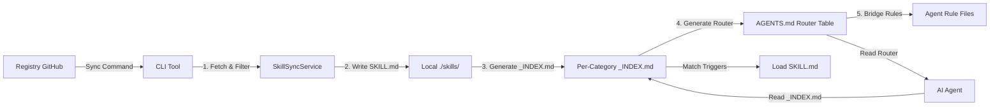

# Architecture & Design Records

This document captures the high-level design, data flow, and key decision records for the `agent-skills-standard` CLI.

## 1. System Overview

The system consists of three main components:

1. **Registry**: A Git repository (or local folder) containing skill definitions (`SKILL.md`) and metadata (`metadata.json`).
2. **CLI**: The tool that fetches, validates, and syncs these skills to a project.
3. **Local Project**: The user's codebase where skills are installed (e.g., `.cursor/skills/`, `.claude/skills/`).

### Data Flow

### Hierarchical Skill Resolution (v2.1+)

AI agents follow a three-step lookup:

1. **AGENTS.md** (~20 lines) — router table maps file extensions to category `_INDEX.md` files.
2. **`_INDEX.md`** (~10-15 lines per category) — tiered trigger table with File Match and Keyword Match sections.
3. **`SKILL.md`** — loaded on-demand only when triggers match.

This replaces the previous flat index (all skills in one list) and reduces scan cost from O(n) to O(1).

## 2. Core Services

### SyncService (`src/services/SyncService.ts`)

The brain of the operation. It orchestrates the synchronization process.

- **Responsibility**: Fetching, filtering/excluding, writing files, generating `_INDEX.md` per category, and generating router-style `AGENTS.md`.
- **Key Dependencies**: `SkillSyncService`, `WorkflowSyncService`, `IndexGeneratorService`, `AgentBridgeService`.
- **Design Principle**: "Safe Overwrite". It respects `custom_overrides` in `.skillsrc`.

### IndexGeneratorService (`src/services/IndexGeneratorService.ts`)

Responsible for creating the "Context Bridge" for AI agents. Produces two output formats:

- **Router Index** (`assembleRouterIndex()`): Compact AGENTS.md that maps file extensions to `_INDEX.md` paths (~20 lines).
- **Category Index** (`generateCategoryIndex()`): Per-category `_INDEX.md` with tiered File Match vs Keyword Match sections.
- **Flat Index** (`assembleIndex()`): Legacy flat list format, still used for the registry's own AGENTS.md.
- **Three-Tier Model**: Skills with broad file globs (e.g., `**/*.ts`) are automatically demoted to Keyword Match unless they are the designated `base_language_skills` for that category (defined in `metadata.json`).

### SkillSyncService (`src/services/SkillSyncService.ts`)

Handles fetching and writing skill files from the remote registry.

- **Responsibility**: Downloading SKILL.md + references from GitHub, writing to agent directories, pruning orphaned skills.

### ConfigService (`src/services/ConfigService.ts`)

Manages the user configuration (`.skillsrc`).

- **Responsibility**: Parsing YAML, validating schema (Zod), and resolving dependency exclusions (e.g. "Don't install React skills if this looks like Vue").

### AgentBridgeService (`src/services/AgentBridgeService.ts`)

Creates agent-specific rule files that point to AGENTS.md.

- **Responsibility**: Generates discovery instructions for each agent (Cursor `.mdc`, Copilot instructions, Claude `CLAUDE.md` protocol, Antigravity/Windsurf/Trae rule files).

## 3. Token Economy (Design Constraint)

This is a **High-Density** project. Every feature must be evaluated against its impact on the AI's context window.

- **Skill Files**: Must be < 100 lines, averaging ~500 tokens.
- **Router Index**: ~20 lines (~600 tokens) — constant regardless of skill count.
- **Category Index**: ~10-15 lines per category.
- **References**: Heavy content goes to `references/` folder, loaded only on demand.

## 4. Metadata Configuration (`skills/metadata.json`)

Registry-level configuration that controls index generation:

- **`file_routing`**: Maps file extensions to skill categories for the router table.
- **`broad_globs`**: List of glob patterns considered "too broad" for auto-triggering (e.g., `**/*.ts`).
- **`base_language_skills`**: One skill per category that keeps the broad glob in File Match. All others are demoted to Keyword Match.
- **`foundational_composite_rules`**: Auto-injected composite triggers based on skill name patterns.
- **`categories`**: Version, tag prefix, and token metrics per category.

## 5. Decision Records

### ADR-001: Local-First Indexing

_Date: 2026-02-07_
**Decision**: `SyncService` should generate the index by scanning the _local_ disk after writing files, rather than using the in-memory list of fetched skills.
**Reason**: This ensures that manual edits or custom local skills created by the user are also included in the index, making the system "User-Extensible" by default.

### ADR-002: Internal Tools Separation

_Date: 2026-02-07_
**Decision**: Documentation scanners and maintenance scripts live in `scripts/` but are NOT bundled into the CLI binary.
**Reason**: Keeps the user-facing CLI binary small and focused.

### ADR-003: Hierarchical Skill Resolution

_Date: 2026-04-04_
**Decision**: Replace the flat AGENTS.md index with a two-level hierarchy: router table + per-category `_INDEX.md` files with tiered trigger sections (File Match vs Keyword Match).
**Reason**: The flat index grew to 238+ entries (~300 lines). LLMs cannot reliably scan a 300-line list to find matching skills. The hierarchical approach reduces scan cost to ~25 lines per lookup regardless of total skill count, and the three-tier model prevents 30+ skills from matching a single file extension.

### ADR-004: Three-Tier Trigger Model

_Date: 2026-04-04_
**Decision**: In `_INDEX.md`, skills are classified into File Match (auto-check against edited file) and Keyword Match (only when user's request mentions the concept). Broad globs are stripped from non-base skills.
**Reason**: Without tiering, editing a `*.ts` file matched 27+ skills simultaneously. With tiering, only 6 genuinely relevant skills match via file pattern. Cross-cutting skills (best-practices, security, performance) activate only when the user explicitly mentions them.
