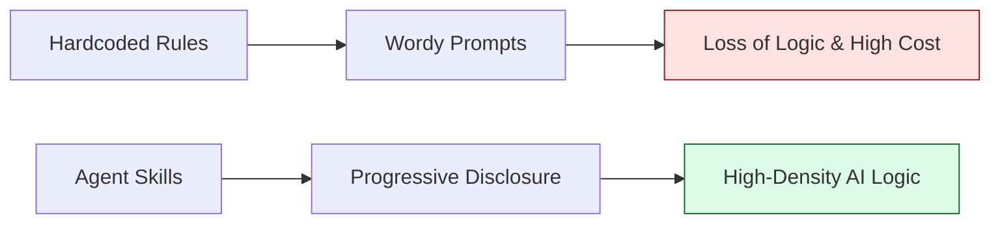

# Agent Skills Standard: High-Density AI Agent Instructions & Cursor Rules 🚀

[](https://www.npmjs.com/package/agent-skills-standard)
[](LICENSE)
[](https://github.com/HoangNguyen0403/agent-skills-standard/stargazers)

**The open standard for High-Density AI coding instructions. Make your AI smarter, faster, and more consistent across your entire team.**

Agent Skills Standard is the open-source framework to distribute, sync, and version-control engineering standards (often called **"Cursor Rules"** or **"Agent Skills"**) across all major AI agents (**Cursor, Claude Code, GitHub Copilot, Windsurf, Trae, Gemini, and more**).

---

## 📌 Table of Contents

- [💡 Why use this? (For Managers & Teams)](#-why-use-this-for-managers--teams)
- [🛡️ Security & Trust (For IT)](#️-security--trust-for-it)
- [🚀 Quick Start (For Developers)](#-quick-start-for-developers)
- [🌍 Supported Frameworks](#-supported-frameworks)
- [⚙️ Configuration (`.skillsrc`)](#️-configuration-skillsrc)
- [❓ FAQ](#-faq--contributing)

---

## 💡 Why use this? (For Managers & Teams)

Think of Agent Skills Standard as a **universal instruction manual** for your AI assistant.

When using AI for work, you constantly have to remind it of your "house rules" (e.g., _"Make sure to handle errors this way"_ or _"Use this specific layout"_). If you feed it too many rules at once, it forgets them or wastes expensive API tokens. If you feed it too few, it writes bad code.

This project solves **"The Context Wall"** by packaging rules into high-density **"Skills"** that you can plug into any AI tool instantly.

| Role                 | Benefit                                                                                                  |
| :------------------- | :------------------------------------------------------------------------------------------------------- |
| **🚀 Builders**      | Stop copy-pasting prompts. Get instant, modular standards directly in your IDE.                          |
| **🛡️ Architects**    | Scale engineering excellence. Define "house rules" once; sync them to every agent in the team.           |
| **📈 Organizations** | Lower the technical barrier. Enable non-experts to produce senior-level output via standard "playbooks." |
| **💰 Finance/Ops**   | Sending a 3,600+ token architect prompt vs. a 413-token skill reduces **API costs by ~9x**.              |

### 🔄 The Workflow



---

## 🛡️ Security & Trust (For IT)

We understand that "injecting" instructions into your AI can sound risky to security teams. Here is how we keep you safe:

- **No Code Execution**: Skills are pure Markdown/JSON files. They contain _text instructions_ for the AI, not executable code. They cannot run commands on your machine.
- **Continuous Benchmarking**: Most skills now include an `evals.json` dataset, used to verify AI adherence to constraints via automated regression testing.
- **Open Source**: The entire registry is open source. You can audit every skill file on GitHub before using it.
- **Sandboxed**: The CLI tool (`agent-skills-standard`) runs in user space to download text files. The "skills" themselves run inside the AI's isolated context window, not as OS processes.
- **Privacy**: We do not collect any code or project data. Feedback is only sent if you manually trigger the `feedback` command or strongly opt-in.

### 🛡️ Adversarial Resilience & Skill Integrity

To ensure that the instructions provided to AI agents are both secure and effective, the standard implements:

- **Red-Team Auditing**: Skills undergo periodic "Pentests" using adversarial workflows to identify logic gaps, prompt injection surfaces, and "instruction drift."
- **Mandatory Zero-Trust Protocol**: All agents working with this standard are bound by **Rule Zero**, which forbids code generation until a multi-step audit of active skills and security standards is performed.
- **Prompt Injection Mitigation**: High-density skill patterns are specifically designed to minimize the risk of AI models ignoring constraints or leaking sensitive context through strategic instruction placement.

---

## 🚀 Quick Start (For Developers)

Consume engineering standards in your project instantly.

### 1. Initialize Your Project

Run this once to detect your stack and setup your `.skillsrc`.

```bash
npx agent-skills-standard@latest init
```

### 2. Sync Standards

Fetch the latest high-density instructions and install them into your hidden agent folders.

```bash
npx agent-skills-standard@latest sync
```

### 3. Start Coding

The CLI automatically updates `AGENTS.md` in your project root. This serves as a universal entry point that helps all AI agents (Cursor, Copilot, etc.) proactively understand when to trigger specific skills based on your project context.

> [!TIP]
> **View all CLI Commands**: Run `npx agent-skills-standard@latest --help` for commands like `validate`, `feedback`, and `upgrade`.

---

## 🌍 Supported Frameworks

The Agent Skills Standard is a modular library. We follow a strict **Token Economy**—every skill is audited for its footprint in the AI's context window (averaging ~400 tokens) to save you money.

<details>
<summary><b>Click to view all 20+ supported frameworks and stacks</b></summary>
<br>

| Stack / Category        | Key Modules                             | Version   | Typical Saving | Skills |
| :---------------------- | :-------------------------------------- | :-------- | :------------- | :----- |
| **Common Patterns**     | Accessibility, Best Practices, Security | `v1.10.0` | 83%            | 29     |
| **Flutter**             | BLoC, Riverpod, Clean Architecture      | `v1.6.1`  | 85%            | 21     |
| **Dart**                | Language, Tooling                       | `v1.3.1`  | 85%            | 3      |
| **TypeScript**          | Type Safety, Tooling                    | `v1.3.1`  | 82%            | 4      |
| **JavaScript**          | Functional Programming, Patterns        | `v1.3.1`  | 89%            | 3      |
| **React**               | React 18+, Hooks, Performance           | `v1.3.1`  | 86%            | 8      |
| **React Native**        | Architecture, Performance               | `v1.4.1`  | 88%            | 13     |
| **NestJS**              | Architecture, Security, BullMQ          | `v1.4.1`  | 82%            | 21     |
| **Next.js**             | App Router, SEO, Performance            | `v1.4.1`  | 82%            | 18     |
| **Angular**             | Architecture, Signals, RxJS             | `v1.3.1`  | 86%            | 16     |
| **Android**             | Compose, Architecture, Serialization    | `v1.3.1`  | 90%            | 22     |
| **iOS**                 | Architecture, SwiftUI, Concurrency      | `v1.4.1`  | 90%            | 15     |
| **Swift**               | Concurrency, Architecture               | `v1.3.1`  | 87%            | 8      |
| **Kotlin**              | Language, Concurrency                   | `v1.3.1`  | 89%            | 4      |
| **Java**                | Language, Concurrency                   | `v1.3.1`  | 86%            | 5      |
| **Spring Boot**         | Architecture, Security                  | `v1.3.1`  | 87%            | 10     |
| **Go (Golang)**         | Clean Architecture, Security            | `v1.3.1`  | 88%            | 11     |
| **PHP**                 | Error Handling, PHP 8+                  | `v1.3.1`  | 86%            | 7      |
| **Laravel**             | Solid Patterns, Clean Architecture      | `v1.3.1`  | 82%            | 10     |
| **Database**            | PostgreSQL, MongoDB, Redis              | `v1.2.2`  | 85%            | 3      |
| **Quality Engineering** | BA, TDD, Zephyr, Automation             | `v1.4.0`  | 81%            | 4      |

> [!TIP]
> **View the Complete Registry**: For a full list of all 160+ individual skills and token metrics, visit the [Skills Directory](./skills/README.md) and [Benchmark Report](./benchmark-report.md).

</details>

---

## ⚙️ Configuration (`.skillsrc`)

The `.skillsrc` file allows you to customize how skills are synced to your project.

```yaml
registry: https://github.com/HoangNguyen0403/agent-skills-standard
agents: [cursor, copilot, kiro]
skills:
  flutter:
    ref: flutter-v1.1.0
    # 🚫 Exclude specific sub-skills from being synced
    exclude: ['getx-navigation']
    # ➕ Include specific skills (supports cross-category 'category/skill' syntax)
    include:
      - 'bloc-state-management'
      - 'react/hooks'
    # 🔒 Protect local modifications from being overwritten
    custom_overrides: ['bloc-state-management']
```

---

## ❓ FAQ & Contributing

<details>
<summary><b>Does this work with Cursor or Gemini?</b></summary>
<br>
Yes. Agent Skills Standard is designed to be "Agent Agnostic." It generates the specific configuration files (like `.cursorrules` or `.agent/skills`) that these tools read natively.
</details>

<details>
<summary><b>How is this different from a system prompt?</b></summary>
<br>
System prompts are static and often too long. Agent Skills Standard uses a <b>Discovery Bridge</b>. The AI only "looks up" the specific engineering standards it needs for the file you are currently editing, keeping its memory (context window) free for your actual code.
</details>

<details>
<summary><b>Can I use this for non-coding tasks (e.g., HR, Finance)?</b></summary>
<br>
Absolutely. While many skills here are technical, the framework works for any domain where you want an AI agent to follow consistent, high-density instructions.
</details>

<br>

### 🏗 Contributing & Development

Interested in adding standards for **NestJS, Golang, or React**?

1. **Propose a Skill**: Open an issue with your draft [High-Density Content](skills/README.md).
2. **Develop Locally**: Fork and add your category to `skills/`.
3. **Submit PR**: Our CI/CD will validate the metadata integrity before merging.

For detailed architecture logic and token calculation scripts, see [CLI Architecture](./cli/ARCHITECTURE.md).

---

## 📄 License & Credits

- **License**: MIT
- **Author**: [Hoang Nguyen](https://github.com/HoangNguyen0403)

### 📜 Benchmark History

| Version | Date       | Skills | Avg Tokens | Savings (%) | Report                                  |
| ------- | ---------- | ------ | ---------- | ----------- | --------------------------------------- |
| v2.0.1  | 2026-03-30 | 238    | 527        | 86%         | [Report](benchmarks/archive/v2.0.1.md)  |
| v2.0.0  | 2026-03-25 | 235    | 523        | 86%         | [Report](benchmarks/archive/v2.0.0.md)  |
| v1.10.3 | 2026-03-21 | 234    | 505        | 86%         | [Report](benchmarks/archive/v1.10.3.md) |
| v1.10.1 | 2026-03-16 | 229    | 428        | 88%         | [Report](benchmarks/archive/v1.10.1.md) |
| v1.10.0 | 2026-03-16 | 229    | 434        | 88%         | [Report](benchmarks/archive/v1.10.0.md) |
