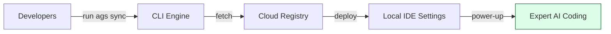

# Agent Skills Standard CLI: Deployment & Sync Engine 🚀

[](https://www.npmjs.com/package/agent-skills-standard)
[](https://github.com/HoangNguyen0403/agent-skills-standard/blob/main/LICENSE)

**The heavy-lifting engine for High-Density AI Agent Instructions. Deploy professional standards to any project in seconds.**

The `agent-skills-standard` CLI is the official command-line tool to manage, sync, and version-control engineering standards (often called **"Cursor Rules"** or **"Agent Skills"**) across all major AI agents (**Cursor, Claude Code, GitHub Copilot, Gemini, Roo Code, and more**).

---

## 📌 Table of Contents

- [💡 What does this tool do?](#-what-does-this-tool-do)
- [🛠 The Solution: Digital DNA for AI](#-the-solution-digital-dna-for-ai)
- [🚀 Installation & Quick Start](#-installation--quick-start)
- [⚙️ Configuration (`.skillsrc`)](#️-configuration-skillsrc)
- [🔒 Privacy & Security](#-privacy--security)
- [❓ FAQ & Links](#-faq--links)

---

## 💡 What does this tool do?

If the **Agent Skills Standard** is the "instruction manual" for your AI, this CLI is the **delivery engine** that brings those instructions to your project.

### 🎯 Who is this for?

| Role                 | Benefit                                                                             |
| :------------------- | :---------------------------------------------------------------------------------- |
| **🚀 Builders**      | No more copy-pasting `.cursorrules`. One command syncs your entire AI workspace.    |
| **🛡️ Architects**    | Push global engineering standards to every developer's IDE automatically.           |
| **📈 Organizations** | Standardize AI behavior across your company. Ensure every agent "knows" your stack. |

### 🔄 CLI Sync Workflow



---

## 🛠 The Solution: Digital DNA for AI

Modern AI coding agents are powerful, but giant rule files consume **30% - 50% of the AI's memory**, making it less effective. Agent Skills Standard solves this by treating prompt instructions as **versioned dependencies**.

- **🎯 Smart Loading**: We use a "Search-on-Demand" pattern. The AI only looks at detailed examples when it specifically needs them, saving its memory for your actual code.
- **🚀 High-Density Language**: We use a specialized "Compressed Syntax" that is **40% more efficient** than normal English. This means the AI understands more while using fewer resources.
- **🔁 One-Click Sync**: A single command ensures your AI tool stays up-to-date with your team's latest standards.

> [!IMPORTANT]
> **Context is Currency**: By reducing instruction overhead by **88%**, you free up your AI's memory and budget for complex logic and large codebases.

---

## 🚀 Installation & Quick Start

You can run the tool instantly without installing, or install it globally for convenience:

```bash
# Use instantly (Recommended)
npx agent-skills-standard@latest init
npx agent-skills-standard@latest sync

# Or install globally
npm install -g agent-skills-standard
ags sync
```

### 🛠 Basic Commands

- `init`: Detect your project type and choose which "skills" you want your AI to have.
- `sync`: Fetch the latest high-density instructions and install them into your hidden agent folders (like `.cursor/skills/` or `.github/skills/`).
- `validate`: Validate custom skills against the standard.
- `feedback`: Submit feedback to improve the global registry.

---

## ⚙️ Configuration (`.skillsrc`)

The `.skillsrc` file allows you to customize how skills are synced to your project.

```yaml
registry: https://github.com/HoangNguyen0403/agent-skills-standard
agents: [cursor, copilot]
skills:
  flutter:
    ref: flutter-v1.1.0
    # 🚫 Exclude specific sub-skills from being synced
    exclude: ['getx-navigation']
    # ➕ Include specific skills (supports cross-category 'category/skill' syntax)
    include:
      - 'bloc-state-management'
      - 'react/hooks'
    # 🔒 Protect local modifications from being overwritten
    custom_overrides: ['bloc-state-management']
  # 🤖 Optional: Sync workflows to .agent/workflows/
  workflows: true
```

---

## 🔒 Privacy & Security

We take security seriously. Here is what you need to know:

- **No Code Execution**: The CLI `sync` command only downloads **text files** (Markdown/JSON). It does _not_ download or execute binaries, scripts, or unknown code.
- **Transparent Operations**: The CLI simply fetches text files from the [official registry](https://github.com/HoangNguyen0403/agent-skills-standard) and copies them to your local `.agent/skills` folder. No background daemons or hidden network calls.
- **Privacy First**: We never collect usage telemetry or analytics. Feedback is only shared if you explicitly trigger it using `ags feedback`.

---

## ❓ FAQ & Links

<details>
<summary><b>Do I need to install this globally?</b></summary>
<br>
We recommend using <code>npx agent-skills-standard sync</code> to always use the latest version without global installation.
</details>

<details>
<summary><b>Does it overwrite my custom rules?</b></summary>
<br>
No. If you have custom rules in <code>.cursorrules</code> or other files, you can use the <code>custom_overrides</code> feature in your <code>.skillsrc</code> and the CLI will intelligently skip overwriting them.
</details>

<br>

### 🔗 Useful Links

- **Registry Source**: [GitHub Repository](https://github.com/HoangNguyen0403/agent-skills-standard)
- **CLI Architecture**: [Internal Services & Design](https://github.com/HoangNguyen0403/agent-skills-standard/blob/develop/cli/ARCHITECTURE.md)
- **Standard Specs**: [Documentation](https://github.com/HoangNguyen0403/agent-skills-standard#📂-standard-specification)
- **Issues**: [Report a bug](https://github.com/HoangNguyen0403/agent-skills-standard/issues)

#### 📜 Benchmark History

| Version | Date | Skills | Avg Tokens | Savings (%) | Report |
| --- | --- | --- | --- | --- | --- |
| v1.10.1 | 2026-03-16 | 229 | 428 | 88% | [Report](benchmarks/archive/v1.10.1.md) |
| v1.10.0 | 2026-03-16 | 229 | 434 | 88% | [Report](benchmarks/archive/v1.10.0.md) |
| v1.9.3 | 2026-03-15 | 229 | 460 | 87% | [Report](benchmarks/archive/v1.9.3.md) |
