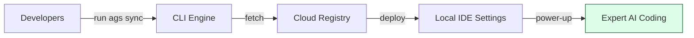

# Agent Skills Standard CLI: Deployment & Sync Engine 🚀

[](https://www.npmjs.com/package/agent-skills-standard)
[](https://github.com/HoangNguyen0403/agent-skills-standard/blob/main/LICENSE)

[](https://github.com/HoangNguyen0403/agent-skills-standard/releases/tag/nestjs-v1.2.1)
[](https://github.com/HoangNguyen0403/agent-skills-standard/releases/tag/nextjs-v1.2.0)
[](https://github.com/HoangNguyen0403/agent-skills-standard/releases/tag/golang-v1.1.0)
[](https://github.com/HoangNguyen0403/agent-skills-standard/releases/tag/angular-v1.2.0)
[](https://github.com/HoangNguyen0403/agent-skills-standard/releases/tag/kotlin-v1.1.0)
[](https://github.com/HoangNguyen0403/agent-skills-standard/releases/tag/java-v1.1.0)
[](https://github.com/HoangNguyen0403/agent-skills-standard/releases/tag/spring-boot-v1.1.0)
[](https://github.com/HoangNguyen0403/agent-skills-standard/releases/tag/android-v1.1.0)
[](https://github.com/HoangNguyen0403/agent-skills-standard/releases/tag/swift-v1.1.0)
[](https://github.com/HoangNguyen0403/agent-skills-standard/releases/tag/ios-v1.2.0)
[](https://github.com/HoangNguyen0403/agent-skills-standard/releases/tag/php-v1.1.0)
[](https://github.com/HoangNguyen0403/agent-skills-standard/releases/tag/laravel-v1.1.0)
[](https://github.com/HoangNguyen0403/agent-skills-standard/releases/tag/database-v1.1.1)
[](https://github.com/HoangNguyen0403/agent-skills-standard/releases/tag/quality-engineering-v1.1.0)

**The heavy-lifting engine for High-Density AI Agent Instructions. Deploy professional standards to any project in seconds.**

The `agent-skills-standard` CLI is the official command-line tool to manage, sync, and version-control engineering standards (often called **"Cursor Rules"** or **"Agent Skills"**) across all major AI agents (**Cursor, Claude Code, GitHub Copilot, Gemini, Roo Code, and more**).

---

## 📌 Table of Contents

- [💡 What does this tool do?](#-what-does-this-tool-do)
- [🎯 Who is this for?](#-who-is-this-for)
- [⚡ The Problem: The Context Wall](#-the-problem-the-context-wall)
- [🛠 The Solution: Digital DNA for AI](#-the-solution-digital-dna-for-ai)
- [🛡️ Security & Trust](#️-security--trust)
- [🚀 Quick Start](#-quick-start)
- [💻 Command Reference](#-command-reference)
- [🌍 Registry Ecosystem](#-registry-ecosystem)
- [🏗 Contributing](#-contributing)
- [❓ FAQ](#-faq)

---

## 💡 What does this tool do?

If the **Agent Skills Standard** is the "instruction manual" for your AI, this CLI is the **delivery engine** that brings those instructions to your project.

### 🎯 Who is this for?

| Role                 | Benefit                                                                             |
| :------------------- | :---------------------------------------------------------------------------------- |
| **🚀 Builders**      | No more copy-pasting `.cursorrules`. One command syncs your entire AI workspace.    |
| **🛡️ Architects**    | Push global engineering standards to every developer's IDE automatically.           |
| **📈 Organizations** | Standardize AI behavior across your company. Ensure every agent "knows" your stack. |

### 🔄 CLI Sync Workflow



---

## ⚡ The Problem: "The Context Wall"

Modern AI coding agents are powerful, but they have major flaws:

1. **Memory Drain**: Giant rule files consume **30% - 50% of the AI's memory**, making it less effective for actual coding.
2. **Version Chaos**: Team members often have different "best practices," leading to inconsistent code.
3. **Wordy Prose**: Human-style instructions are token-heavy and often ignored by AI during complex logical tasks.

**Agent Skills Standard** solves this by treating prompt instructions as **versioned dependencies**, similar to how you manage software libraries.

---

## 🛠 The Solution: Digital DNA for AI

Agent Skills Standard treats instructions as **versioned dependencies**, much like software libraries.

- **🎯 Smart Loading**: We use a "Search-on-Demand" pattern. The AI only looks at detailed examples when it specifically needs them, saving its memory for your actual code.
- **🚀 High-Density Language**: We use a specialized "Compressed Syntax" that is **40% more efficient** than normal English. This means the AI understands more while using fewer resources.
- **🔁 One-Click Sync**: A single command ensures your AI tool stays up-to-date with your team's latest standards.

---

## 🛡️ Security & Trust

We take security seriously. Here is what you need to know about how the CLI works:

- **No Hidden Scripts**: The CLI `sync` command only downloads **text files** (Markdown/JSON). It does _not_ download or execute binaries, scripts, or unknown code.
- **No "Code Injection"**: When we say "injection", we mean **Prompt Injection** (adding context to the AI's conversation history), NOT code injection (running malware).
- **Transparent Operations**:
  - The CLI fetches a standard directory structure from the [official registry](https://github.com/HoangNguyen0403/agent-skills-standard).
  - It copies these text files to your local `.cursor/skills` or `.agent/skills` folder.
  - It updates `AGENTS.md` (a text file index).
  - **That is it.** No background services, no daemons, no hidden network calls.

---

## 📊 Efficiency & Benchmark

Every skill delivered by this CLI is audited for its footprint in the AI's context window.

| Metric             | Typical Saving  | Status | Version  | Avg. Footprint |
| :----------------- | :-------------- | :----- | :------- | :------------- |
| **Global Average** | **88% Savings** | 10/10  | `v1.1.0` | ~398 tokens    |

> [!IMPORTANT]
> **Context is Currency**: By reducing instruction overhead by **88%**, you free up your AI's memory and budget for complex logic and large codebases.

- **🛡️ Multi-Agent Support**: Out-of-the-box mapping for Cursor, Claude Dev, GitHub Copilot, and more.
- **📦 Modular Registry**: Don't load everything. Only enable the skills your project actually uses.
- **⚡ Proactive Activation (Universal)**: Generates a compressed index in `AGENTS.md` for 100% activation reliability across Cursor, Windsurf, Claude Code, and more.
- **🔄 Dynamic Re-detection**: Automatically re-enables skills if matching dependencies are added.
- **🔒 Secure Overrides**: Lock specific files so they never get overwritten.
- **📊 Semantic Tagging**: Skills tagged with triggers for exact application.
- **🤖 Agent Workflows**: Sync executable workflows (.md files) that agents can follow to perform complex tasks.

---

#### 📜 Benchmark History

| Version | Date | Skills | Avg Tokens | Savings (%) | Report |
| --- | --- | --- | --- | --- | --- |
| v1.9.3 | 2026-03-15 | 229 | 460 | 87% | [Report](benchmarks/archive/v1.9.3.md) |
| v1.9.2 | 2026-03-07 | 228 | 458 | 87% | [Report](benchmarks/archive/v1.9.2.md) |
| v1.9.1 | 2026-03-07 | 228 | 458 | 87% | [Report](benchmarks/archive/v1.9.1.md) |

## � Token Economy & Optimization

To ensure AI efficiency, this project follows a strict **Token Economy**. Every skill is audited for its footprint in the AI's context window.

### 📏 Our Standards

- **High-Density**: Core rules in `SKILL.md` are kept under **100 lines**.
- **Efficiency**: Target **< 500 tokens** per primary skill file.
- **Progressive Disclosure**: Heavy examples, checklists, and implementation guides are moved to the `references/` directory and are only loaded by the agent when specific context matches.

## 🔒 Privacy & Feedback

### Feedback Reporter Skill

By default, the CLI syncs a `common/feedback-reporter` skill that enables you to report when AI makes mistakes or when skill guidance needs improvement. **This helps us improve skills for everyone.**

**What Gets Shared (Only if AI Agent Report):**

- Skill category/name
- Issue description (written by you or generated by AI)
- **Skill Instruction**: Exact quote from the skill that was violated
- **Actual Action**: What the AI did instead
- **Decision Reason**: Why the AI chose that approach
- Optional context (framework version, scenario)
- Optional AI Model name
- **NO code, NO project details, NO personal information**

**How to Opt-Out:**
Add to `.skillsrc`:

```yaml
skills:
  common:
    exclude: ['feedback-reporter']
```

**How to Report Issues:**
Use structured comments:

```typescript
// @agent-skills-feedback
// Skill: react/hooks
// Issue: AI suggested unsafe pattern
// Suggestion: Add guidance for this case
```

**Privacy First**: We never collect usage telemetry or analytics. Feedback is only shared if you explicitly trigger it.

#### Manual Feedback

If you notice a skill needs improvement, you can manually send feedback using:

```bash
ags feedback
```

Or via structured comments in your code:

```typescript
// @agent-skills-feedback
// Skill: react/hooks
// Issue: AI suggested unsafe pattern
// Suggestion: Add guidance for this case
```

## 🚀 Installation

You can run the tool instantly without installing, or install it globally for convenience:

```bash
# Use instantly (Recommended)
npx agent-skills-standard@latest sync

# Or install globally
npm install -g agent-skills-standard

# Use the short alias
ags sync
```

---

## 🛠 Basic Commands

### 1. Setup Your Project

Run this once to detect your project type and choose which "skills" you want your AI to have.

```bash
npx agent-skills-standard@latest init
```

### 2. Boost Your AI

Run this to fetch the latest high-density instructions and install them into your hidden agent folders (like `.cursor/skills/` or `.github/skills/`).

```bash
npx agent-skills-standard@latest sync

```

---

## ⚙️ Configuration (`.skillsrc`)

The `.skillsrc` file allows you to customize how skills are synced to your project.

```yaml
registry: https://github.com/HoangNguyen0403/agent-skills-standard
agents: [cursor, copilot]
skills:
  flutter:
    ref: flutter-v1.1.0
    # 🚫 Exclude specific sub-skills from being synced
    exclude: ['getx-navigation']
    # ➕ Include specific skills (supports cross-category 'category/skill' or 'category/*' syntax)
    include:
      - 'bloc-state-management'
      - 'react/hooks'
      - 'common/*'
    # 🔒 Protect local modifications from being overwritten
    custom_overrides: ['bloc-state-management']
  # 🤖 Optional: Sync workflows to .agent/workflows/
  workflows: true
```

### Key Options

- **`exclude`**: A list of skill IDs to skip during synchronization.
- **`include`**: A list of skill IDs to fetch. Supports:
  - **Relative Path**: `bloc-state-management` (from current category)
  - **Absolute Path**: `react/hooks` (pull specific skill from another category)
  - **Glob Path**: `common/*` (pull ALL skills from another category)
- **`custom_overrides`**: A list of skill IDs that the CLI should **never** overwrite.
- **`ref`**: Specify a specific version or tag for the skills.

---

## ✨ Key Features

- **🎯 Efficiency First**: Uses a "Search-on-Demand" pattern that only loads information when the AI needs it, saving its "brain power" for your code.
- **🚀 High-Density Instructions**: Optimized syntax that is **40% more compact** than standard English.
- **🛡️ Universal Support**: Works out-of-the-box with Cursor, Claude, GitHub Copilot, and more.
- **🔒 Secure Protection**: Mark specific files as "Locked" (overrides) so the CLI never changes your custom tweaks.
- **🧪 Production-Grade Reliability**: Guarded by a 100% statement coverage test suite and strict CI enforcement.

### 📂 Browse All Available Skills

The Agent Skills Standard is a modular library designed to be the universal language for engineering standards. Browse the categories below to see the key modules and metrics for each stack.

| Stack / Category        | Key Modules                             | Typical Saving | Status  | Version  | Skills | Avg. Footprint |
| :---------------------- | :-------------------------------------- | :------------- | :------ | :------- | :----- | :------------- |
| **Common Patterns**     | Accessibility, Best Practices, Security | **82%**  | Healthy  | `v1.7.2` | 25     | ~657 tokens    |
| **Flutter**             | BLoC, Riverpod, Clean Architecture      | **87%**  | Healthy  | `v1.4.1` | 21     | ~466 tokens    |
| **Dart**                | Language, Tooling                       | **87%**  | Healthy  | `v1.1.0` | 3      | ~459 tokens    |
| **TypeScript**          | Type Safety, Tooling                    | **85%**  | Healthy  | `v1.1.0` | 4      | ~541 tokens    |
| **JavaScript**          | Functional Programming, Patterns        | **89%**  | Healthy  | `v1.1.0` | 3      | ~408 tokens    |
| **React**               | React 18+, Hooks, Performance           | **88%**  | Healthy  | `v1.1.0` | 8      | ~427 tokens    |
| **React Native**        | Architecture, Performance               | **87%**  | Healthy  | `v1.2.0` | 13     | ~469 tokens    |
| **NestJS**              | Architecture, Security, BullMQ          | **84%**  | Healthy  | `v1.2.1` | 21     | ~570 tokens    |
| **Next.js**             | App Router, SEO, Performance            | **86%**  | Healthy  | `v1.2.0` | 18     | ~506 tokens    |
| **Angular**             | Architecture, Signals, RxJS             | **92%**  | Healthy  | `v1.2.0` | 15     | ~307 tokens    |
| **Android**             | Compose, Architecture, Networking       | **91%**  | Healthy  | `v1.1.0` | 22     | ~315 tokens    |
| **iOS**                 | Architecture, SwiftUI, Concurrency      | **88%**  | Healthy  | `v1.2.0` | 15     | ~431 tokens    |
| **Swift**               | Concurrency, Architecture               | **90%**  | Healthy  | `v1.1.0` | 8      | ~377 tokens    |
| **Kotlin**              | Language, Concurrency                   | **87%**  | Healthy  | `v1.1.0` | 4      | ~475 tokens    |
| **Java**                | Language, Concurrency                   | **85%**  | Healthy  | `v1.1.0` | 5      | ~543 tokens    |
| **Spring Boot**         | Architecture, Security                  | **89%**  | Healthy  | `v1.1.0` | 10     | ~393 tokens    |
| **Go (Golang)**         | Clean Architecture, Security            | **89%**  | Healthy  | `v1.1.0` | 10     | ~398 tokens    |
| **PHP**                 | Error Handling, PHP 8+                  | **91%**  | Healthy  | `v1.1.0` | 7      | ~340 tokens    |
| **Laravel**             | Solid Patterns, Clean Architecture      | **90%**  | Healthy  | `v1.1.0` | 10     | ~383 tokens    |
| **Database**            | PostgreSQL, MongoDB, Redis              | **80%**  | Healthy  | `v1.1.1` | 3      | ~720 tokens    |
| **Quality Engineering** | BA, TDD, Zephyr, Automation             | **87%**  | Healthy  | `v1.1.0` | 4      | ~480 tokens    |

> [!TIP]
> **View the Complete Registry**: For a full list of all 160+ skills, visit the [Skills Directory](../skills/README.md).

> [!TIP]
> Run `ags benchmark` (coming soon) or check the [root report](../benchmark-report.md) for full scientific methodology.

---

## ❓ FAQ

### Do I need to install this globally?

We recommend using `npx agent-skills-standard sync` to always use the latest version without global installation.

### Does it overwrite my custom rules?

No. If you have custom rules in `.cursorrules` or other files, you can use the `Locked` feature or the CLI will intelligently merge them if configured.

---

## 🔗 Links

- **Registry Source**: [GitHub Repository](https://github.com/HoangNguyen0403/agent-skills-standard)
- **CLI Architecture**: [Internal Services & Design](https://github.com/HoangNguyen0403/agent-skills-standard/blob/develop/cli/ARCHITECTURE.md)
- **Standard Specs**: [Documentation](https://github.com/HoangNguyen0403/agent-skills-standard#📂-standard-specification)
- **Issues**: [Report a bug](https://github.com/HoangNguyen0403/agent-skills-standard/issues)

---
